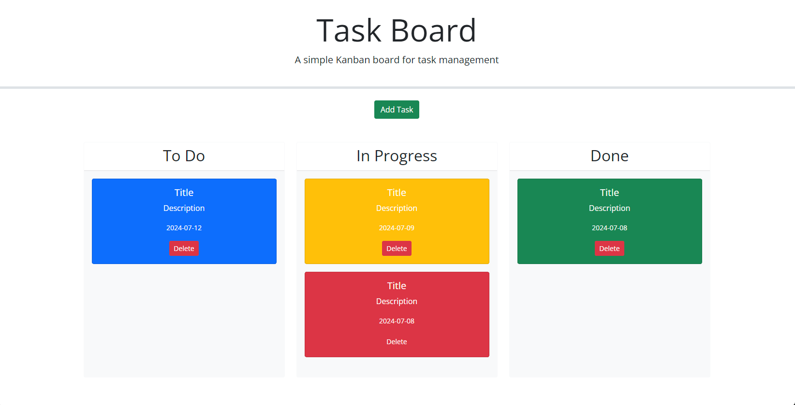

**Task Board Project**
Overview
The Task Board project is a simple Kanban board application for task management. It allows users to add, delete, and move tasks between different stages: "To Do", "In Progress", and "Done". The project uses HTML, CSS, JavaScript, jQuery, jQuery UI, Bootstrap, and Day.js.

**Features**
Add Task: Users can add a new task with a title, description, and due date.
Delete Task: Users can delete a task from any stage.
Drag and Drop: Users can move tasks between stages using drag and drop.
Due Date Highlighting: Tasks are color-coded based on their due date:
Blue for upcoming tasks.
Yellow for tasks due today.
Red for overdue tasks.
Green for completed tasks.

**Requirements**
Web Browser
Internet connection (to load external libraries)

**Usage**
Open the application:

Open index.html in a web browser.
Add a Task:

Click on the "Add Task" button.
Fill in the task title, description, and due date.
Click "Add Task" to save the task.
Delete a Task:

Click the "Delete" button on the task card you want to remove.

Move Tasks:

Drag and drop tasks between "To Do", "In Progress", and "Done" columns.

**Files and Structure**
index.html: Main HTML file containing the structure of the Kanban board.
./Assets/css/style.css: Custom CSS file for styling.
./Assets/js/script.js: Main JavaScript file containing the functionality of the Kanban board.

**External Libraries**
Bootstrap: For responsive layout and styling.
Font Awesome: For icons.
Google Fonts: For custom fonts.
jQuery: For DOM manipulation and event handling.
jQuery UI: For drag-and-drop functionality and date picker.
Day.js: For date manipulation.
License
This project is licensed under the MIT License - see the LICENSE file for details.

**Acknowledgments**
Bootstrap: https://getbootstrap.com/
Font Awesome: https://fontawesome.com/
Google Fonts: https://fonts.google.com/
jQuery: https://jquery.com/
jQuery UI: https://jqueryui.com/
Day.js: https://day.js.org/

Webpage Link: file:///C:/Users/erich/bootcamp/Challenge/mod5chal/Interactive-Task-Board/index.html